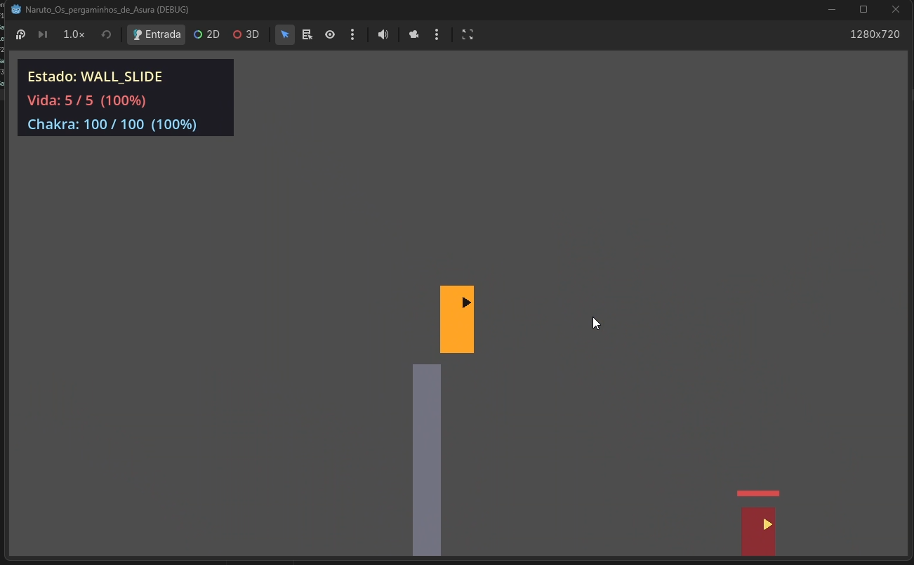
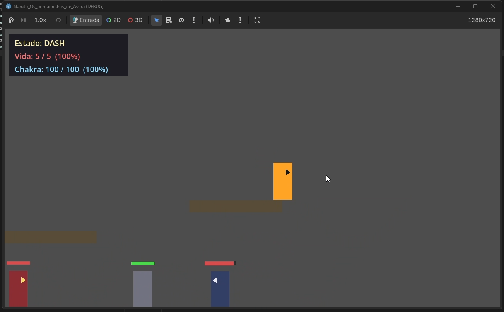
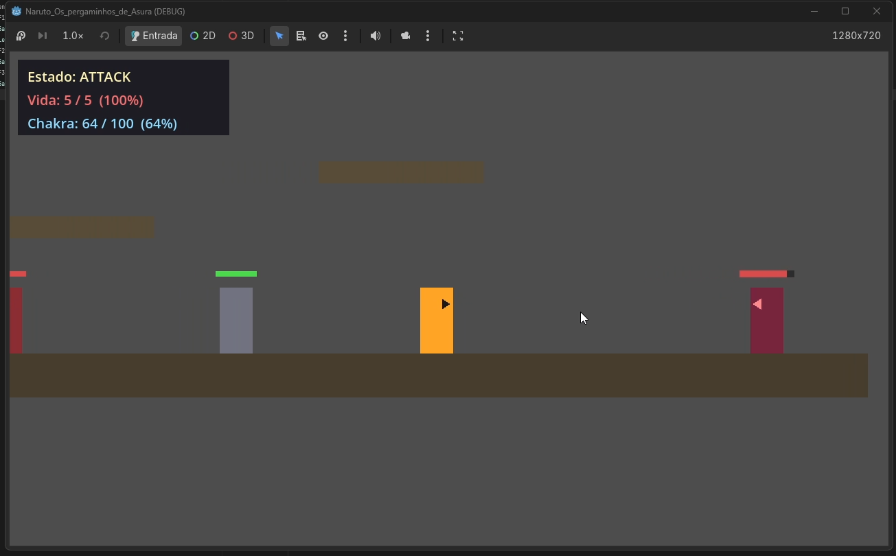
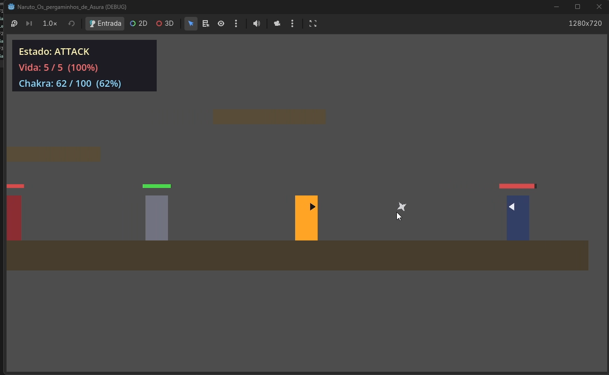
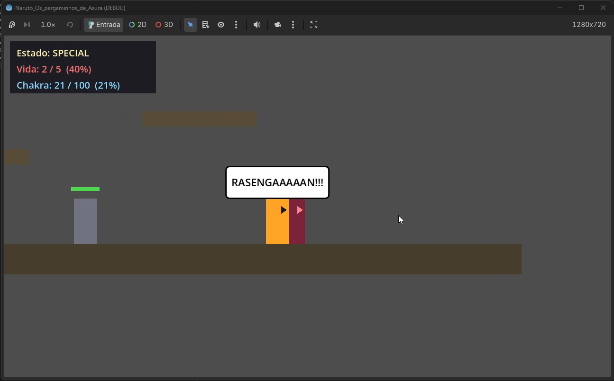
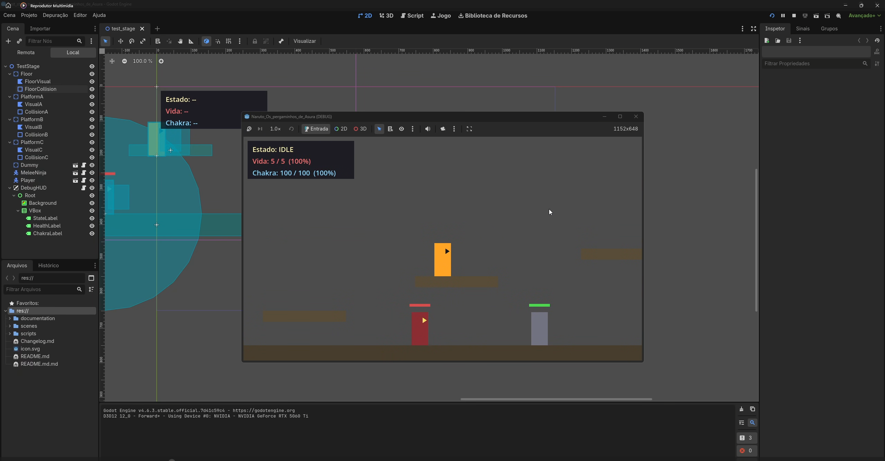
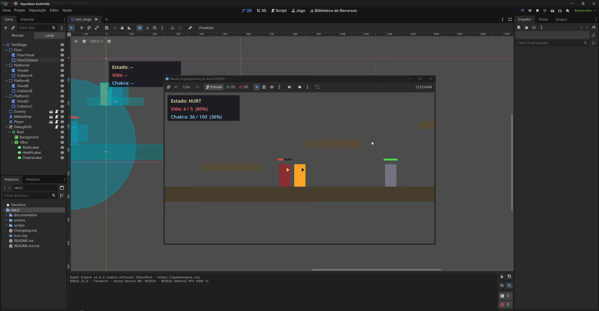
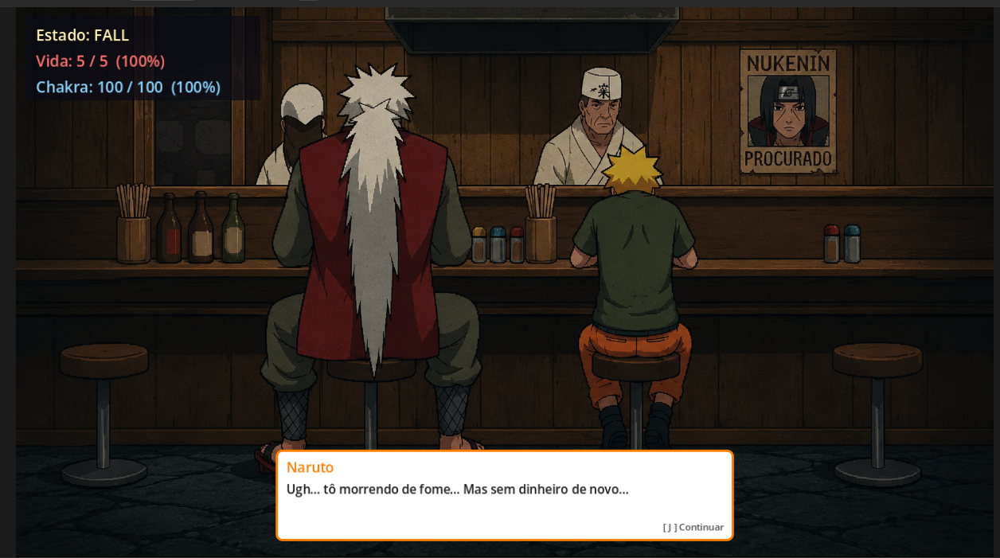
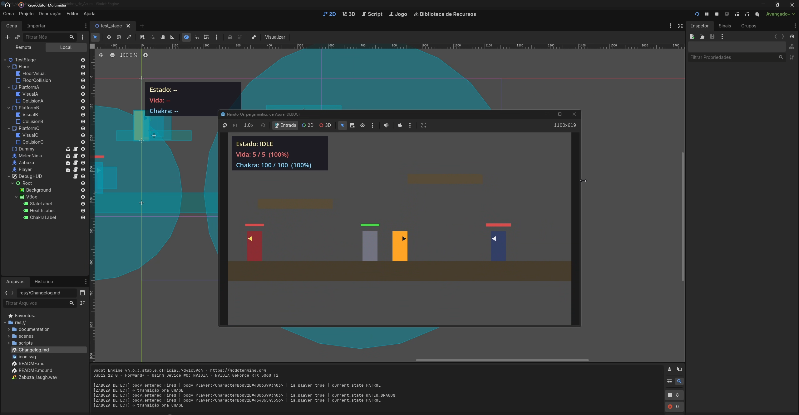
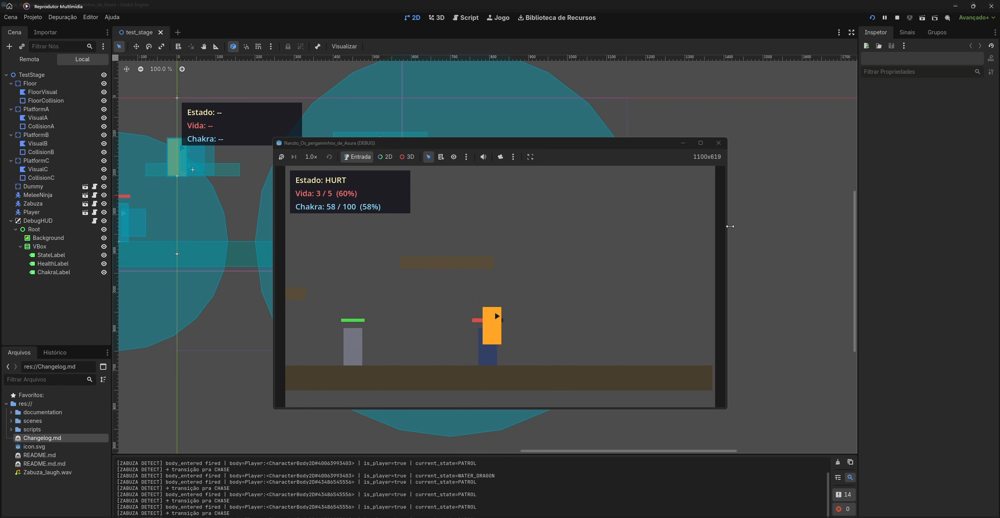

# Pergaminho de Asura — MVP de Combate & IA (Godot 4)

> **Vertical slice** focado em mecânicas de combate 2D e IA reativa.
> Engine: **Godot 4.6**, renderer **Compatibility** (`gl_compatibility`) — GDScript tipado, código modular, signals-first.

---

## Status

Projeto em desenvolvimento, mantido como portfólio técnico.

- **Funcional e testado:** movimentação (FSM de 12 estados), combate de 3 frentes, IA do inimigo melee, boss, sistema de diálogo, cutscenes, save em memória e transição entre zonas.
- **Parcial:** a estrutura narrativa prevê 5 zonas lineares — 2 existem como placeholder, 3 ainda não foram criadas.
- **Pendente:** os 13 sprites do Naruto estão no repositório mas **ainda não integrados à FSM** — o jogo roda com retângulos de placeholder fora das cutscenes. `CollectibleSystem` não implementado.

A maioria das capturas deste README vem da **arena de teste** (`test_stage`), onde as formas são retângulos coloridos. Isso é método, não descuido: a FSM e o combate são validados sem arte, para que bug de gameplay não se esconda atrás de sprite. A seção *Diálogo e cutscenes* mostra a arte final.

---

## 1. Apresentação Geral

**Pergaminho de Asura** é um protótipo de plataforma/ação 2D inspirado no universo Naruto. O escopo é deliberadamente apertado — um personagem jogável, um inimigo melee, um boss, uma arena de teste — todos servindo a um objetivo: **investigar profundidade em sistemas de combate e IA reativa antes de escalar conteúdo**.

A meta do MVP não é quantidade de fases ou personagens. É:

- **Game feel** apurado — pulo, combo, chakra e respawn impecáveis ao toque.
- **IA preditiva** — inimigo que detecta, persegue, **escala plataformas verticalmente** e responde a impactos com knockback direcional e stun.
- **Arquitetura limpa** — componentes reaproveitáveis (`Hitbox` / `Hurtbox`), FSMs explícitas, signals plugáveis em zero-polling.

O repositório consolida o **Core Gameplay** — movimentação fluida, FSM de 12 estados, combate de 3 frentes (combo melee + projétil + special com custo de chakra), HUD de debug em tempo real, kill zone com respawn e IA reativa com pulo preditivo — e, sobre ele, a camada narrativa: diálogo, cutscenes, gerenciamento de zonas e persistência.

---

## 2. Arquitetura & Árvore de Cenas

A modularidade se apoia em **três pilares de isolamento**:

1. **Entidades físicas** — `CharacterBody2D` para corpos com movimento próprio (Player, MeleeNinja) e `StaticBody2D` para geometria estática (Floor, plataformas, Dummy). Nenhum interage com a camada de combate diretamente.
2. **Áreas reativas** — `Area2D` para todo o pipeline de detecção (`Hitbox` ofensiva, `Hurtbox` defensiva, `DetectionArea` de percepção). Vivem em layers próprias e não influenciam fisicamente o `CharacterBody2D` pai.
3. **Camada de apresentação** — `CanvasLayer` independente para o HUD, plugado nos signals do `PlayerController` (`state_changed`, `health_changed`, `chakra_changed`) sem polling por frame.

### Árvore da arena de teste

```
TestStage (Node2D)
├── Floor / PlatformA / PlatformB / PlatformC   (StaticBody2D + Polygon2D + CollisionShape2D)
├── Dummy (StaticBody2D)                        — alvo passivo, vida 3, respawn 1s
│   ├── Visual / BodyShape / HPBar
│   └── Hurtbox (Area2D, layer enemy_hurtbox)
├── MeleeNinja (CharacterBody2D)                — IA completa
│   ├── Visual / BodyShape / HPBar
│   ├── Hurtbox       (Area2D, layer enemy_hurtbox)
│   ├── Hitbox        (Area2D, layer enemy_hitbox)   — golpe melee
│   └── DetectionArea (Area2D, CircleShape2D r=280) — percepção
├── Player (CharacterBody2D, grupo "Player")    — Naruto
│   ├── Visual / FaceMarker / ChakraSprite / CollisionShape2D / Camera2D
│   ├── ShurikenSpawnStand / ShurikenSpawnCrouch (Marker2D)
│   ├── HitboxLight   (Area2D, dmg 1)
│   ├── HitboxSpecial (Area2D, dmg 3)
│   ├── Hurtbox       (Area2D, layer player_hurtbox)
│   └── RasengaBalloon
└── DebugHUD (autoload, CanvasLayer)            — overlay
```

### Separação física × reativa × apresentação

| Camada | Tipo de nó | Layer / máscara | Responsabilidade |
|---|---|---|---|
| Player body | `CharacterBody2D` | layer **8** `player_body`, mask 1 | Movimento, gravidade, colisão com o mundo |
| MeleeNinja body | `CharacterBody2D` | layer **7** `enemy_body`, mask 1 | Idem, isolado da camada de combate |
| Hitbox ofensiva | `Area2D` + `hitbox.gd` | layer **2** `player_hitbox` / **5** `enemy_hitbox` | Causa dano ao tocar uma Hurtbox |
| Hurtbox defensiva | `Area2D` + `hurtbox.gd` | layer **3** `enemy_hurtbox` / **6** `player_hurtbox` | Recebe e repassa o hit via signal |
| DetectionArea | `Area2D` | mask **8** `player_body` | Percepção do Player |
| DebugHUD | `CanvasLayer` + `Control` | — (sem física) | UI screen-space, signals-driven |

Cada par ofensivo/defensivo enxerga apenas o seu oposto: a hitbox do Player mascara `enemy_hurtbox`; a do inimigo mascara `player_hurtbox`. Corpos e áreas nunca se cruzam.

### FSM do Player — 12 estados

`IDLE · MOVE · JUMP · FALL · CROUCH · DASH · WALL_SLIDE · ATTACK · SPECIAL · CHAKRA_CHARGE · HURT · DEATH`


*Arena de teste — estado `WALL_SLIDE`: gravidade reduzida ao segurar a direção contra a parede, com recarga do double jump e wall jump disponível.*


*Arena de teste — estado `DASH`, disparado por double-tap na direção: override horizontal, i-frames e gravidade suspensa durante a janela.*

### Responsabilidades por script

| Script | Responsabilidade |
|---|---|
| `player_controller.gd` | FSM do jogador (12 estados), física, input, chakra, kill zone. |
| `melee_ninja.gd` | FSM do inimigo (6 estados), percepção, pulo preditivo. |
| `zabuza.gd` | FSM do boss (9 estados). |
| `hitbox.gd` | Componente `Area2D` ofensivo reusável (`damage`, signal `hit_landed`). |
| `hurtbox.gd` | Componente `Area2D` defensivo reusável (`take_hit` → signal `hit_taken`). |
| `shuriken.gd` | Projétil que **estende** `Hitbox` — movimento próprio + auto-destruct. |
| `dummy.gd` | Alvo passivo de testes — recebe hits, flasha, respawna. |
| `debug_hud.gd` | Plugado em `state_changed`, `health_changed`, `chakra_changed`. Zero polling. |

---

## 3. Sistemas de Combate e Recursos

### Combo Leve (**J**) — 3 hits encadeados com micro-dash automático

O combo opera dentro de uma **cancel window** definida pelo último 25% da duração de cada ataque (`attack_cancel_window_ratio = 0.25`). Apertar **J** novamente dentro dessa janela reentra o estado `ATTACK` aplicando um **micro-impulso de `velocity.x = 250 px/s * facing_direction`** (decai pela friction em ~5 frames), dando ao Naruto um leve "tranco" a cada hit conectado.

| Hit | Custo de chakra | Damage | Ganho de terreno por dash |
|---|---|---|---|
| H1 (entrada) | 0 | 1 | — |
| H2 (cancel window) | 0 | 1 | ~10 px |
| H3 (cancel window) | 0 | 1 | ~10 px |
| **Total do combo** | **0** | **3** | **~30 px** |

A FSM faz `_exit_state(State.ATTACK)` + `_enter_state(State.ATTACK)` manualmente, **sem** passar pelo `_change_state` (que bloqueia transições mesmo→mesmo), reciclando hitbox, signals `attack_started`/`attack_ended` e o `_state_timer`.


*Arena de teste — hit conectado: a barra de vida do MeleeNinja recua e o feedback de impacto dispara. O pipeline `Hitbox → Hurtbox → take_hit → hit_taken` fecha em um frame.*

### Shuriken (**K**) — projétil físico com alcance limitado

`Shuriken` estende `Hitbox` e é spawnada como sibling do Player no momento do arremesso, a partir de `ShurikenSpawnStand` ou `ShurikenSpawnCrouch`. Auto-destrói após **600 px** percorridos OU ao atingir uma `Hurtbox` válida.

| Parâmetro | Valor |
|---|---|
| Damage | 1 |
| Custo de chakra | **40** |
| Alcance máximo | **600 px** |
| Velocidade de voo | 800 px/s |
| Spin visual | 12 rad/s |

A direção é setada por `direction = Vector2(facing_direction, 0)` **antes** de adicionar à árvore — garantindo que o `_physics_process` do projétil já comece com o vetor correto.


*Arena de teste — shuriken em trajetória, com o chakra em 62% após o custo de 40 ser debitado.*

### Rasengan (**O**) — special com dash melee

O `State.SPECIAL` aplica um impulso `velocity.x = 1300 * facing_direction` no `_enter_state`, fazendo o Naruto **avançar cerca de 264 px** em direção ao alvo antes de descarregar a `HitboxSpecial` (raio 45 px, damage 3). A friction do chão decai o dash em ~0.41s.

| Parâmetro | Valor |
|---|---|
| Damage | 3 (one-shot no Dummy de 3 HP) |
| Custo de chakra | **70** |
| Dash inicial | 1300 px/s |
| Alcance total efetivo | ~360 px |


*Arena de teste — `SPECIAL` executado: o chakra caiu para 21% (custo 70) e o `RasengaBalloon` acompanha o Player em world-space, não em screen-space.*

### Gerenciamento dinâmico de Chakra

A barra de 0–100 é o recurso central do combate. Os custos altos (40 / 70) impõem uma **decisão tática contínua**: estocar para o Rasengan ou gastar em shurikens?

| Fonte | Variação |
|---|---|
| Regen passiva (fora de `CHAKRA_CHARGE`) | **+8/s** |
| `chakra_charge` (segurar Shift Esq.) | +35/s (barra cheia em ~12.5s; 70 de chakra em ~2s) |
| Shuriken (**K**) | **−40** |
| Rasengan (**O**) | **−70** |

Com máximo 100, a barra cheia comporta **1 Rasengan + 0.75 shuriken**, OU **2 shurikens com 20 sobrando**, OU 1 Rasengan + um breve `chakra_charge` para outro recurso. **Sempre há uma escolha.**

---

## Dinâmica de Combate em Ação


*Arena de teste — o MeleeNinja golpeia na beira do precipício, ativando o hitstun e resultando em queda livre até a kill zone.*

Este frame congela o instante em que **todos os subsistemas cooperam sem nenhum scripting específico** para produzir uma situação emergente. O MeleeNinja perseguiu o Player até a borda em CHASE, entrou na fase `active` do ATTACK, e a hitbox conectou. O `_take_damage()` então executou a linha que define o resultado:

```gdscript
var knockback_dir: float = signf(global_position.x - source_position.x)
velocity.x = hurt_knockback_speed * knockback_dir
```

Como o ninja estava à esquerda, `signf` retornou `+1`, e o knockback de **350 px/s empurrou o Player para a direita** — em direção ao precipício. O `_change_state(State.HURT)` trancou o input por 0.4s de hitstun (mais 0.4s de i-frames em sequência), e o Player atravessou a borda antes de poder reagir. A partir daí: `_check_kill_zone()` detectou `position.y > 1000`, disparou `_respawn()` → `get_tree().reload_current_scene()`, e o ciclo reiniciou limpo.

O ponto técnico é que **o knockback não é decorativo — ele é geográfico**. Ao se basear na posição relativa do atacante em vez de uma direção fixa, o efeito reage à geometria do mundo. Uma plataforma com borda exposta vira automaticamente uma situação letal **sem que o level design precise inserir trigger zones**. O combate perigoso emerge da combinação entre física, knockback direcional e kill zone compartilhada por Player e MeleeNinja.

---

## Painel de Debug e Ciclo de Vida

Os três frames abaixo mapeiam o ciclo completo da máquina de estados e do `DebugHUD` reativo durante o pipeline de dano. Toda label é atualizada via signals (`state_changed`, `health_changed`, `chakra_changed`) — **zero polling por frame** — e o `_ready()` inclui guardas defensivas contra `null instance` + sincronização manual dos valores iniciais. Mesmo após o reload completo da árvore, o painel reinicializa sem warnings no console.


*Arena de teste — estado inicial IDLE com o DebugHUD sincronizado e blindado (Vida 5/5).*

O frame mostra o HUD em seu estado canônico após o `_ready()`. Os signals do `PlayerController` são conectados e os handlers `_on_state_changed`, `_on_health_changed` e `_on_chakra_changed` são invocados **manualmente** com os valores iniciais — garantindo sincronia mesmo que a primeira emissão tenha ocorrido antes do `connect()`. Se a referência do Player retornar `null` (ordem de `_ready` invertida, cena carregando, refactor de hierarquia), o `push_warning` dispara, as labels exibem o fallback `"—"`, e a HUD permanece visível em vez de quebrar a cena.


*Arena de teste — pipeline de dano em ação: Naruto em HURT sofrendo o tranco horizontal (Vida 4/5).*

O pipeline `Hitbox → Hurtbox → take_hit → _on_hit_taken → _take_damage → _change_state(HURT)` acabou de fechar. A transição emite simultaneamente:

- `health_changed(4, 5)` → label vermelha para `"Vida: 4 / 5 (80%)"`
- `state_changed(MOVE, HURT)` → label amarela para `"Estado: HURT"`

Internamente, `_enter_state(HURT)` setou `_state_timer = hurt_stun_duration (0.4s)` e `_invulnerability_timer = invulnerability_duration (0.8s)`, desligou as hitboxes ofensivas (defesa contra hit mid-attack que deixaria um swing órfão), e o knockback decai pela friction. **Nenhum input é lido durante o estado** — `_state_hurt(delta)` chama apenas `_apply_horizontal_movement(delta, 0.0)`. O bloqueio de comandos é propriedade emergente da FSM, não uma flag manual.


*Arena de teste — Naruto em DEATH (HP 0/5), iniciando o freeze de 1.5s antes do reload.*

A vida zerou. O `_take_damage` detectou `current_health <= 0` **antes** de aplicar o knockback (early-return que evita o tranco visualmente "engolido" pela morte) e chamou `_change_state(State.DEATH)`. O `_enter_state(DEATH)` zerou `velocity`, setou `_state_timer = death_respawn_delay (1.5s)`, desligou as hitboxes, emitiu `player_died` (gancho para áudio/VFX futuros) e travou input. Quando o timer zera, `_respawn()` dispara `get_tree().reload_current_scene()` — **a fase inteira rebuilda**: MeleeNinja, Dummy, plataformas, signals, HUD.

A robustez do ciclo se apoia em três princípios:

- **Signals-first** — ninguém faz polling. Mudanças disparam emissões; listeners reagem em callback.
- **Reload completo em vez de reset local** — elimina estado vazado entre vidas (timer preso, hitbox esquecida ligada, signal duplamente conectado).
- **Guardas defensivas no `_ready`** — cada referência inter-nó passa por `get_node_or_null` + cast tipado + early return + fallback visual.

---

## 4. Máquina de Estados do Inimigo

O `melee_ninja.gd` implementa uma FSM enum-based com **6 estados** e signal `state_changed(previous, new)` plugável em UI, áudio e VFX.

### Diagrama de transições

```
        ┌──────────┐
        │   IDLE   │
        └────┬─────┘
             │ (timer 0.5–1.5s aleatório expira)
        ┌────▼─────┐
        │  PATROL  │   patrol_speed = 80 px/s
        └────┬─────┘   dentro de patrol_distance = 220 px do spawn
             │
             │ (player entra na DetectionArea)
        ┌────▼─────┐
        │  CHASE   │   chase_speed = 160 px/s, facing dinâmico
        └────┬─────┘
             │ (|distância horizontal| < attack_range = 60 + cooldown ok)
        ┌────▼─────┐
        │  ATTACK  │   windup(0.30s) → active(0.15s) → recovery(0.35s)
        └────┬─────┘   + cooldown(0.8s)
             │
             └──→ CHASE (se player ainda detectado) OU PATROL

  EM QUALQUER ESTADO (Hurtbox.hit_taken):
    │
┌───▼──────┐
│   HURT   │   stun 0.25s + knockback 280 px/s na direção oposta ao golpe
└───┬──────┘
    │ (HP > 0)        │ (HP ≤ 0)
    ▼                  ▼
  CHASE ou PATROL  ┌──────────┐
                   │   DEAD   │ → invisível por 2s → renasce no spawn
                   └──────────┘
```

### IDLE — pausa orgânica entre pernas de patrol

Velocidade horizontal decai por friction (`move_toward(velocity.x, 0.0, ground_friction * delta)`). Um timer aleatório em `[patrol_pause_min, patrol_pause_max]` segura o inimigo no lugar, dando personalidade de "olhar em volta antes de andar de novo".

### PATROL — vai-e-vem em torno do spawn

Caminha a **80 px/s** em `facing_direction`. Quando `position.x - _spawn_position.x` ultrapassa `patrol_distance = 220` em módulo, OU quando `is_on_wall()` retorna true, o inimigo **vira** e transiciona para `IDLE`. O ciclo `PATROL → IDLE → PATROL` repete até o jogador aparecer.

### CHASE — perseguição reativa por frame

Recalcula `horizontal_distance` a cada `_physics_process`, atualiza `facing_direction` para apontar ao jogador e aplica `velocity.x = chase_speed * facing_direction`. Se a distância cai abaixo de `attack_range = 60 px` **E** `_attack_cooldown_timer` está zerado, transiciona para `ATTACK`.

### ATTACK — três fases internas + cooldown externo

A FSM do ataque é, na prática, **uma sub-FSM** dentro do estado:

```gdscript
match _attack_phase:
    "windup":   if _state_timer <= 0: → active   + _enable_attack_hitbox()
    "active":   if _state_timer <= 0: → recovery + hitbox.disable()
    "recovery": if _state_timer <= 0: → set cooldown + back to CHASE/PATROL
```

A telegrafia de **0.30s no windup** dá ao jogador uma janela clara para reagir — esquivar, contra-atacar com Rasengan ou disparar uma shuriken antes do impacto. O design escolhe **legibilidade** acima de "pegadinhas de timing".

### Sistema de Percepção — `Area2D` circular

A `DetectionArea` é uma `Area2D` com `CircleShape2D` (raio **280 px**) e `collision_mask` apontando para a layer **8 (`player_body`)** — dedicada ao corpo do jogador. O callback ainda revalida o tipo antes de assumir o alvo:

```gdscript
func _on_body_entered_detection(body: Node2D) -> void:
    if body is PlayerController:
        _player = body
        if current_state == State.PATROL or current_state == State.IDLE:
            _change_state(State.CHASE)
```

A máscara dedicada já restringe o que entra na área; a checagem `is PlayerController` permanece como **redundância defensiva**, garantindo o cast seguro antes de guardar a referência.

---

## 5. IA de Movimentação Vertical — Pulo Preditivo no CHASE

A IA do `MeleeNinja` tem um **gatilho de pulo dentro do CHASE** para impedir que o jogador escape verticalmente subindo em plataformas.

### Condição de gatilho — três checks em AND lógico

```gdscript
if is_on_floor() and is_on_wall() and _player.global_position.y < global_position.y - 50.0:
    velocity.y = enemy_jump_velocity   # -650.0
```

| Verificação | Significado |
|---|---|
| `is_on_floor()` | Inimigo grounded — só pula de superfície sólida. |
| `is_on_wall()` | Há **barreira física à frente** — esbarrando na quina de uma plataforma ou parede. |
| `_player.global_position.y < global_position.y - 50.0` | Player **significativamente acima** (margem de 50 px) — vale gastar o pulo. |

A condição só dispara com as três `true` **simultaneamente**. Após o pulo, `is_on_floor()` retorna `false` e a condição falha sozinha — **sem cooldown explícito nem flag anti-spam**.

### Verificação de barreira via `is_on_wall()`

A leitura vem do próprio motor — `CharacterBody2D` mantém o flag interno após cada `move_and_slide()`. Quando o ninja encosta lateralmente em uma plataforma flutuante (a parte de baixo é tratada como "wall" pelo solver, porque a normal da colisão é vertical), o flag fica `true` naquele frame.

Combinado com a leitura de `_player.global_position.y`, o inimigo só pula quando **há plataforma à frente E o jogador está em cima dela** — comportamento que parece proposital, não aleatório.

### Matemática da subida — calibrada com a gravidade

Com `enemy_jump_velocity = -650` e `GRAVITY = 1400`:

- **Pico vertical**: 650² / (2 · 1400) ≈ **151 px**.
- **Duração do arco** (subida + descida): 2 · 650 / 1400 ≈ **0.93 s**.
- **Cobertura horizontal no pulo**: 160 px/s × 0.93 s ≈ **149 px**.

### Escalada progressiva entre plataformas

O ninja **não tem pathfinding global** — só reage a condições locais. Ainda assim, escala todas as plataformas do `test_stage` em sequência:

| De | Para | Altura (px) | Cabe num pulo? |
|---|---|---|---|
| Chão (y=368) | PlatformA (y=268) | 100 | Sim — sobra 51 px |
| PlatformA | PlatformB (y=168) | 100 | Sim — mesma margem |
| PlatformB | PlatformC (y=88) | 80 | Sim — confortável |

### Compatibilidade com a trava de gravidade

A ordem das operações em `_physics_process` é o que faz o pulo funcionar **mesmo com `velocity.y = 0.0` aplicado por `_apply_gravity` a todo frame on-floor**:

```
1. _apply_gravity(delta)         ← zera velocity.y se on_floor
2. _tick_timers(delta)
3. _process_current_state(delta) ← _state_chase SETA velocity.y = -650 depois do zero
4. _update_visual_facing()
5. move_and_slide()              ← move o corpo com o impulso intacto
```

O estado roda **depois** da gravidade, então a atribuição sobrescreve o zero. Sem conflito de prioridade.

---

## 6. Camada Narrativa — Diálogo, Cutscenes e Progressão

Sobre o núcleo de combate, o projeto construiu a camada que sustenta a progressão. Todos os sistemas abaixo estão implementados.

### Autoloads

| Autoload | Arquivo | Papel |
|---|---|---|
| `LevelManager` | `scripts/systems/level_manager.gd` | Transição entre zonas e respawn central (`RESPAWN_ZONE = zona_2`). |
| `DialogueManager` | `scripts/systems/dialogue_manager.gd` | Fila de falas, avanço e o signal `line_advanced(index)`. |
| `SaveSystem` | `scripts/systems/save_system.gd` | Snapshot em memória de HP, chakra e pergaminhos. |
| `DebugHUD` | `scenes/ui/debug_hud.tscn` | Overlay de debug; reconecta ao Player via `node_added` + grupo `"Player"`. |

### DialogueSystem

`DialogueManager` (autoload) + `DialogueBox` (UI). O diálogo **pausa o jogo** (`get_tree().paused = true`), e a `DialogueBox` roda com `process_mode = ALWAYS` para continuar respondendo enquanto tudo mais está congelado.

A caixa segue estética de mangá — fundo branco com borda colorida por personagem:

| Personagem | Cor da borda |
|---|---|
| Naruto | laranja |
| Jiraiya | verde |
| Pain | roxo |
| Konan | azul |
| Tobi | laranja escuro |
| *(desconhecido)* | `DEFAULT_COLOR` (preto) |

O `DialogueTrigger` é um `Area2D` com dois modos: **AUTO** (dispara ao entrar na área) e **INTERACTION** (exige input do jogador).

### Cutscenes

As cutscenes reagem ao signal `DialogueManager.line_advanced(index)` para **trocar texturas em sincronia com a fala** — a imagem muda conforme o diálogo avança, sem timeline própria.

- **Ichiraku** — integrada e testada. É uma **sub-scene da Zona 4**, não um `change_scene_to_file`: o Player permanece na árvore, preservando estado.
- **Akatsuki** — integrada. Abre com o frame A (Pain, mão na cabeça) e troca para o frame B na segunda linha. Um rewrite para 3 beats (intro → facepalm → kamui) está planejado junto com a construção da Zona 5.


*Arte final — cutscene do Ichiraku com a `DialogueBox` em estilo mangá e a borda colorida identificando quem fala. Diferente das capturas anteriores, aqui não há placeholder: é o alvo visual do projeto (arte desenhada / cel-shaded).*

### Componentes de transição

- **`FadeTransition`** — componente genérico com `fade(callback)` e signal `fade_completed`, duração padrão 0.5s. Desacopla o efeito de quem o usa.
- **`KamuiTrigger`** — ativo em `akatsuki_hideout`; resolve o Player pelo grupo `"Player"`, com fallback via `get_nodes_in_group`.
- **`RasengaBalloon`** — balão de fala do Rasengan em **world-space** (filho do Player), não screen-space: acompanha a câmera junto com o personagem.

### Boss — Zabuza

`zabuza.gd` implementa o `BossController` com FSM de **9 estados**, seguindo o mesmo padrão enum-based + signals do inimigo comum.


*Arena de teste — o boss Zabuza. Como o restante do combate, a FSM foi construída e validada sobre formas primitivas antes de qualquer arte.*


*Arena de teste — fase de ataque melee do boss.*

### Persistência

`SaveSystem` mantém um snapshot **em memória** de HP, chakra e pergaminhos, com API `save()`, `load_into()`, `reset()` e `has_data()`. O `load_into()` reemite `health_changed` e `chakra_changed` no Player após restaurar — sincronizando a HUD sem esperar a próxima emissão natural. Não há gravação em disco: a persistência cobre a travessia entre zonas, não entre execuções.

### Estrutura do jogo — 5 zonas lineares

| Zona | Cena | Status |
|---|---|---|
| 1 | `zona_1_floresta_morte.tscn` | não criada |
| 2 | `zona_2_casa_central.tscn` | placeholder + `JiraiyaTrigger` AUTO |
| 3 | `zona_3_arvores_gigantes.tscn` | não criada |
| 4 | `zona_4_aldeia_corredor.tscn` | não criada (cutscene do Ichiraku pronta para encaixar) |
| 5 | `floresta_da_nevoa.tscn` | placeholder da Zona 5 (cutscene Akatsuki pronta) |

Regra de progressão fechada: **morte → respawn sempre na Zona 2**, independente da zona atual. Sem checkpoints.

---

## 7. Post-Mortem de Bugs Críticos

A integração da IA passou por dois bugs de física **não-triviais**. Ambos foram diagnosticados e resolvidos com correções cirúrgicas.

### Bug 1 — *Jittering* (micro-quiques verticais no chão)

**Sintoma**: o `MeleeNinja` em `IDLE` e `PATROL` vibrava verticalmente (~1–2 px) a cada frame, **mesmo parado em superfície plana**. O Player, com `CharacterBody2D` idêntico, não sofria do mesmo problema.

**Diagnóstico**: o `_apply_gravity` original retornava cedo quando `is_on_floor()` era `true`, **sem zerar `velocity.y`**:

```gdscript
func _apply_gravity(delta: float) -> void:
    if is_on_floor():
        return  # ← velocity.y mantinha o valor positivo da última queda
    velocity.y = minf(velocity.y + GRAVITY * delta, MAX_FALL_SPEED)
```

Quando o inimigo aterrissava após o spawn — mesmo uma queda mínima conta — `velocity.y` ficava pequeno mas positivo. Em frames de borda, quando `is_on_floor()` oscila entre `true` e `false` por **imprecisão numérica do solver**, a gravidade voltava a somar sobre esse valor. O `move_and_slide` gerava o quique.

**Por que o Player não sofria**: por hábito de movimento. O jogador raramente fica parado — pula, anda, cai — e o `velocity.y` reseta naturalmente. O inimigo em `PATROL` **fica sobre o chão por longos períodos**, expondo o bug em forma pura.

**Correção** — trava ativa de `velocity.y`:

```gdscript
func _apply_gravity(delta: float) -> void:
    if is_on_floor():
        velocity.y = 0.0   # ← zera ATIVAMENTE no on_floor
        return
    velocity.y = minf(velocity.y + GRAVITY * delta, MAX_FALL_SPEED)
```

Cada frame `on_floor` reseta o eixo Y antes de qualquer física rodar. O loop `gravity acumula → move_and_slide empurra → is_on_floor flicker → gravity acumula` é cortado na raiz.

### Bug 2 — *Sanduíche de Colisão* (overlap geométrico no spawn)

**Sintoma**: depois da correção do jittering, o `MeleeNinja` **ainda vibrava** — mas agora travado sob a quina esquerda da `PlatformA`, sem conseguir andar.

**Diagnóstico geométrico**: o spawn original estava em `Vector2(-300, 368)`, **exatamente sob o volume da `PlatformA`**. As caixas se sobrepunham desde o frame 0:

| Volume | x range | y range |
|---|---|---|
| MeleeNinja shape (no spawn) | `[-324, -276]` | `[272, 368]` |
| PlatformA shape | `[-520, -280]` | `[268, 300]` |
| **Overlap real** | **`[-324, -280]` (44 px)** | **`[272, 300]` (28 px)** |

O ninja nascia com a cabeça dentro da plataforma. O engine tentava resolver pelo menor caminho (28 px vertical para baixo), mas o chão bloqueava — então tentava o segundo menor (44 px horizontal), gerando um empurrão constante que conflitava com o `velocity.x` da IA.

**Correção dupla**:

**1. Reposicionamento de spawn** em `test_stage.tscn`:

```diff
- position = Vector2(-300, 368)
+ position = Vector2(-150, 368)
```

No novo spawn, o shape do inimigo `[-174, -126]` fica a **106 px de clearance** da borda direita da `PlatformA`. **Zero overlap** inicial.

**2. `floor_snap_length = 12.0`** no `_ready()`:

```gdscript
func _ready() -> void:
    floor_snap_length = 12.0   # snap ativo no chão em todas as transições
    current_health = max_health
    _spawn_position = position
    ...
```

Essa propriedade nativa força o engine a buscar ativamente o chão num raio de **12 px** após cada `move_and_slide()`. Mesmo se a IA caminhar sob a `PlatformA` durante o PATROL, o snap empurra o corpo de volta ao chão — sem permitir que o engine resolva o overlap empurrando o ninja para cima.

A combinação — **geometria limpa no spawn** + **snap defensivo contínuo** — eliminou o sanduíche.

---

## Como rodar localmente

1. Baixe **Godot 4.6+** em [godotengine.org](https://godotengine.org).
2. Clone este repositório.
3. No Godot: **Import** → selecione `project.godot`.
4. **F5** — abre em `scenes/test_stage.tscn`.

### Controles

| Ação | Teclado |
|---|---|
| Mover | ← → · A D |
| Pular | ↑ · W |
| Agachar | ↓ · S |
| Combo leve | **J** |
| Shuriken | **K** |
| Rasengan | **O** |
| Concentrar chakra | Shift Esq. |

> Há um mapeamento de gamepad configurado no Input Map (analógico/DPad, A, X, Y, B e gatilho direito). **Ainda não validado em hardware** — por isso não consta como suporte oferecido.

---

## Estrutura de pastas

```
naruto-game/
├── project.godot                  # config, Input Map, layers, autoloads
├── README.md · CLAUDE.md          # vitrine · governança do projeto
├── contexto.md · decisoes.md      # estado atual · decisões de design fechadas
├── Changelog.md · SUGESTOES.md    # histórico de mudanças · backlog
├── icon.svg
├── assets/
│   ├── audio/                     # Zabuza_laugh.wav
│   ├── backgrounds/               # Vila_da_folha + akatsuki/ + ichiraku/
│   └── sprites/                   # Naruto_chakra_charge + naruto/ (13 sprites + alternates/)
├── levels/
│   ├── zona_2_casa_central.tscn
│   └── floresta_da_nevoa.tscn     # placeholder da Zona 5
├── scenes/
│   ├── test_stage.tscn            # arena de teste (cena principal)
│   ├── player/                    # player.tscn
│   ├── entities/                  # dummy · melee_ninja · shuriken · zabuza
│   ├── components/                # dialogue_trigger · fade_transition · rasengan_balloon
│   ├── cutscenes/                 # ichiraku · akatsuki_hideout
│   └── ui/                        # debug_hud · dialogue_box
├── scripts/
│   ├── player/                    # player_controller.gd
│   ├── entities/                  # dummy · melee_ninja · shuriken · zabuza
│   ├── components/                # hitbox · hurtbox · dialogue_trigger · fade_transition
│   │                              #   kamui_trigger · rasengan_balloon
│   ├── cutscenes/                 # ichiraku · akatsuki_hideout
│   ├── systems/                   # level_manager · dialogue_manager · save_system
│   ├── debug/                     # debug_zone_switch
│   └── ui/                        # debug_hud · dialogue_box
├── documentation/
│   ├── capturas/                  # imagens usadas neste README
│   └── produto/                   # documentos de escopo e metodologia
└── docs/                          # resumos de sessão
```

---

## Licença

Projeto pessoal de portfólio, sem fins comerciais. **Naruto** é propriedade de Masashi Kishimoto / Shueisha / TV Tokyo / Pierrot. Este projeto é uma homenagem fan-made.
